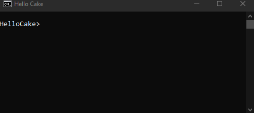

# HelloCake

Basic example of a hello world script using Cake



# Quickstart

1. Install .NET Core 3.1 SDK ( https://dotnet.microsoft.com/download )
1. `dotnet tool restore`
1. dotnet cake hello.cake

# Walk-through

## Obtaining .NET

Easiest way to obtain .NET Core is following instructions on https://dotnet.microsoft.com/download

## Obtaining Cake

Once you cloned this repository, go to it's folder in terminal and type

```bash
dotnet tool restore
```

this will fetch and install a C# scripting runtime called Cake, console output should look something like this (you might see a newer version number)

```bash
Tool 'cake.tool' (version '0.36.0') was restored. Available commands: dotnet-cake

Restore was successful.
```

### Script
`hello.cake` is a Cake C# script file which you can open in a text editor i.e. Notepad, VSCode, Sublime, etc.

```csharp
Information("Hello World");
```

#### Execution

When the Cake tool is instal, scripts can be executed from the terminal by typing

```bash
dotnet cake hello.cake
```

#### Expected output

Our sample `hello.cake` script should output

```
Hello World
```
